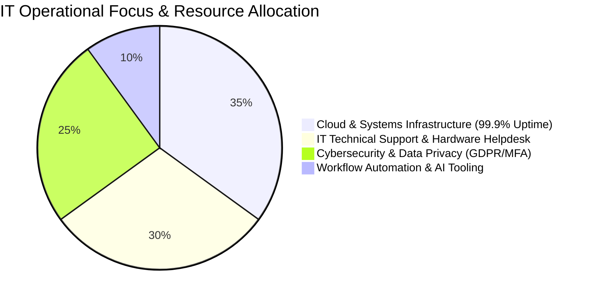
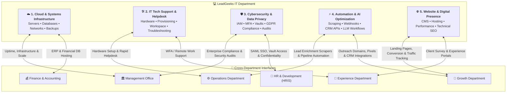
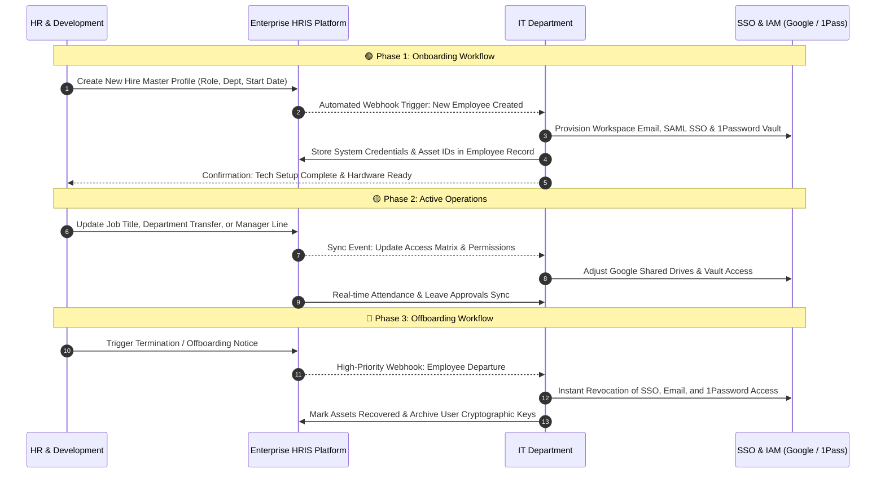
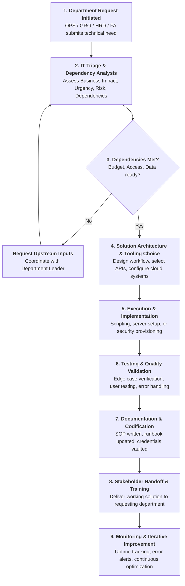

# IT Functional Mapping — Responsibilities, Systems & Dependencies

> **"A Comprehensive Blueprint of IT Functions, Operational Responsibilities, Core Toolchains, and Cross-Departmental Dependencies."**  
> *LeadGeeks Inc. • Information Technology Department*  
> *Architecture & Governance Reference • IT Manager: Ardhian Agung Prasetyo*

---

## 📽️ Executive Slide Presentation


---

## 🌐 1. Executive Summary & Functional Architecture

The **Information Technology (IT)** Department at LeadGeeks Inc. operates as the foundational technical engine that powers all daily operations, secure client delivery, growth automation, and corporate infrastructure.

Rather than operating in an isolated silo, IT maintains structured interfaces with every department across **five core functional domains**:
1. **Cloud & Systems Infrastructure Management** (35% allocation)
2. **IT Technical Support & Helpdesk** (30% allocation)
3. **Cybersecurity, IAM & Data Protection** (25% allocation)
4. **Technology Optimization, Automation & AI Tooling** (10% allocation)
5. **Website Management & Digital Presence** (Shared Infrastructure)



---

## 🗺️ 2. Comprehensive IT Functional Map



---

## 🔍 3. In-Depth Function Breakdown: Responsibilities, Tools & Dependencies

```
┌────────────────────────────────────────────────────────────────────────────┐
│                        THE 4 MAPPING DIMENSIONS                            │
├────────────────────┬───────────────────────────────────────────────────────┤
│ 1. FUNCTION        │ Scope, core mission, and operational boundary.        │
├────────────────────┼───────────────────────────────────────────────────────┤
│ 2. RESPONSIBILITIES│ Concrete daily and strategic deliverables.            │
├────────────────────┼───────────────────────────────────────────────────────┤
│ 3. MAIN SYSTEMS    │ Primary software, cloud services, and infrastructure. │
├────────────────────┼───────────────────────────────────────────────────────┤
│ 4. DEPENDENCIES    │ Upstream requirements (inputs) and downstream impact. │
└────────────────────┴───────────────────────────────────────────────────────┘
```

---

### Function 1: Cloud & Systems Infrastructure Management

* **Core Mission**: Architecting, scaling, and maintaining resilient, high-availability cloud architecture to ensure **99.9% uptime**, zero data loss, and uninterrupted global connectivity.
* **Key Responsibilities**:
  * Provisioning and maintaining Linux VPS instances, container runtimes, and application servers.
  * Architecting managed PostgreSQL databases with read replicas and automated point-in-time recovery.
  * Executing automated, encrypted daily off-site backups with strict retention policies.
  * Managing DNS zoning, CDN caching, SSL/TLS certificate renewals, and reverse proxies.
  * Monitoring network latency, resource saturation, and server health with automated alert triggers.
* **Main Systems & Tooling**:
  * **Cloud Providers**: DigitalOcean Droplets, AWS (EC2/S3/RDS), Google Cloud Platform (Compute Engine/Cloud Run).
  * **Databases & Storage**: Managed PostgreSQL, Redis cache layers, AWS S3 / Cloudflare R2 bucket storage.
  * **Networking & Edge**: Cloudflare Enterprise CDN, Route53 DNS, Nginx / Caddy reverse proxies, Let's Encrypt SSL.
  * **Monitoring & Alerts**: Uptime Kuma, Prometheus/Grafana, Sentry error monitoring, automated Slack webhooks.
* **Dependencies**:
  * **Upstream Inputs**:
    * Management Office: Infrastructure budget allocation and multi-region scaling mandates.
    * Finance & Accounting: Cloud invoice approvals, reserved instance purchase authorizations.
  * **Downstream Consumers**:
    * Operations & Growth: Depend on zero server downtime for daily scraping, database enrichment, and CRM sync.
    * Entire Company: Relies on cloud storage availability and DNS resolution for all internal apps.

---

### Function 2: IT Technical Support & Helpdesk (End-User Productivity)

* **Core Mission**: Providing rapid, empathetic, and effective technical support to empower all LeadGeeks staff with optimized hardware, productivity software, and seamless remote WFA/WFC setups.
* **Key Responsibilities**:
  * Standardizing workstation configurations, OS installation, and hardware inventory tracking.
  * Provisioning Google Workspace accounts, distribution lists, shared drives, and user permissions.
  * Troubleshooting hardware defects, network connectivity issues, peripheral failures, and OS errors.
  * Managing software licenses, seat allocations, and productivity tool rationalization.
  * Maintaining IT helpdesk queues with rapid first-response time (<15 min) and prompt resolution SLAs.
* **Main Systems & Tooling**:
  * **Identity & Office Suite**: Google Workspace Admin Console, Google Drive Shared Drives, Google Meet/Calendar.
  * **Helpdesk & Ticketing**: Dedicated Slack `#it-support` channel, Notion Helpdesk tracker, Jira Service Desk.
  * **Remote Diagnostics**: TeamViewer, AnyDesk, Chrome Remote Desktop for remote staff troubleshooting.
  * **Asset Management**: Snipe-IT / Notion Hardware Registry, MDM profiles for company laptops.
* **Dependencies**:
  * **Upstream Inputs**:
    * HRD: Timely new-hire onboarding alerts and planned departure notifications.
    * Management Office: Approval for new hardware procurement and laptop upgrade cycles.
  * **Downstream Consumers**:
    * Every Team Member: Uninterrupted hardware reliability, email delivery, and software access.
    * Operations ISRs: Fast replacement of malfunctioning equipment to prevent lead generation delays.

---

### Function 3: Cybersecurity, IAM & Data Protection (25% Resource Allocation)

* **Core Mission**: Enforcing defense-in-depth cybersecurity protocols to defend proprietary intellectual property, customer data, and employee identity against leaks, intrusion, and compliance breaches.
* **Key Responsibilities**:
  * Enforcing mandatory Multi-Factor Authentication (2FA/MFA) and biometric authentication company-wide.
  * Administering centralized Identity & Access Management (IAM) with strict Least-Privilege Role-Based Access Control (RBAC).
  * Managing corporate credential vaults, rotating shared API tokens, and eliminating hardcoded secrets.
  * Deploying endpoint encryption (FileVault/BitLocker) and monitoring for suspicious access patterns.
  * Conducting periodic security vulnerability scans, penetration tests, and employee phishing simulations.
  * Enforcing regulatory compliance standards (GDPR, CCPA, CAN-SPAM) and confidential client NDAs.
* **Main Systems & Tooling**:
  * **Password & Vault Management**: 1Password Enterprise, automated vault sharing, secure developer secrets.
  * **Authentication**: Google Workspace SAML SSO, 2FA/MFA (Google Authenticator, YubiKey FIDO2).
  * **Edge & Network Security**: Cloudflare Web Application Firewall (WAF), DDoS mitigation, WireGuard / OpenVPN.
  * **Compliance & Auditing**: Audit trails, access log aggregators, GitHub secret scanning, SOC2/GDPR checklists.
* **Dependencies**:
  * **Upstream Inputs**:
    * Management Office: Enterprise compliance guidelines and risk tolerance standards.
    * HRD: Background checks, employee contract NDAs, and disciplinary protocols.
  * **Downstream Consumers**:
    * Finance & Accounting: Secure ERP access and protected banking/payroll credentials.
    * Client Relationships (via Experience): Proof of data privacy, ISO/GDPR compliance, and client trust.

---

### Function 4: Technology Optimization, Automation & AI Tooling

* **Core Mission**: Designing, building, and maintaining automated data pipelines, custom web scrapers, and AI workflows that multiply team velocity and lower operational friction.
* **Key Responsibilities**:
  * Developing resilient web scraping scripts to extract and normalize B2B market intelligence.
  * Building custom webhook pipelines that synchronize lead data across scraping pools, databases, and CRMs.
  * Implementing generative AI prompts and API integrations to summarize, categorize, and draft outreach at scale.
  * Setting up automated email warmup infrastructure and secondary sending domain rotators.
  * Continuously auditing existing Zapier, Make, and Python scripts to eliminate rate limits and pipeline failures.
* **Main Systems & Tooling**:
  * **Programming & Runtimes**: Python (Playwright, BeautifulSoup, Pandas), Node.js / TypeScript, Bash scripting.
  * **Integration Platforms**: Make.com, Zapier, Webhook endpoints, Retool internal dashboards.
  * **AI & LLM Services**: OpenAI API (GPT-4o), Anthropic API (Claude 3.7), Google Gemini API, LangChain.
  * **Lead Generation & Sales Tech**: Clay.com, Apollo.io API, Smartlead, Instantly.ai, HubSpot / Salesforce CRM.
  * **Code Repository & CI/CD**: GitHub, GitHub Actions, Docker containers, automated cron runners.
* **Dependencies**:
  * **Upstream Inputs**:
    * Operations: Specific ICP criteria, lead list parameters, and daily volume targets.
    * Growth: Outbound campaign schedules, copy variants, and tracking pixel requirements.
  * **Downstream Consumers**:
    * Operations ISRs: High-quality, verified leads delivered directly into outreach platforms without manual copy-pasting.
    * Growth Sales Team: Automated inbound demo booking notifications and real-time CRM enrichment.

---

### Function 5: Website Management & Digital Presence

* **Core Mission**: Ensuring LeadGeeks' web properties deliver world-class performance, mobile responsiveness, ironclad uptime, and technical SEO compliance to maximize inbound conversion.
* **Key Responsibilities**:
  * Overseeing full-lifecycle frontend web development, component updates, and responsive UI maintenance.
  * Optimizing Core Web Vitals (LCP, FID, CLS), CDN asset caching, and image compression for sub-second page loads.
  * Managing technical SEO architecture: XML sitemaps, robots.txt, OpenGraph tags, schema markup, and canonical URLs.
  * Managing domain portfolio renewals, DNS records, and SSL certificates across all company web assets.
  * Embedding and auditing privacy-compliant tracking pixels (GA4, GTM, LinkedIn Insight Tag, Meta Pixel).
* **Main Systems & Tooling**:
  * **Frontend & CMS**: SvelteKit / Next.js, Webflow, WordPress, Tailwind CSS, Vercel / Cloudflare Pages.
  * **Analytics & Tag Management**: Google Analytics 4 (GA4), Google Tag Manager (GTM), Google Search Console.
  * **Performance Audits**: Google PageSpeed Insights, Lighthouse, GTmetrix, Hotjar user session recordings.
* **Dependencies**:
  * **Upstream Inputs**:
    * Growth: Landing page copy, campaign graphics, conversion funnels, and value propositions.
    * Management Office: Brand positioning guidelines and official corporate messaging.
  * **Downstream Consumers**:
    * Growth & Marketing: Inbound leads generated directly through high-converting web forms.
    * Prospective Clients: First impression of LeadGeeks' technical competence and digital authority.

---

## 👥 4. Specialized Deep-Dive: IT & HRD Intersection (Focus on HRIS)

> **Operational Directive**:  
> *The intersection between Information Technology and Human Resources & Development must center strictly around the **Human Resource Information System (HRIS)** as the single source of truth for all employee lifecycle events.*



### Key IT-HRD HRIS Responsibilities

1. **Centralized HRIS Architecture**:
   * IT maintains the hosting, database integrity, and encryption standards for the HRIS database.
   * Field-level encryption ensures that sensitive employee compensation, tax, and health information cannot be viewed by unauthorized staff.
2. **Automated Webhook Onboarding / Offboarding**:
   * Eliminates manual delay and security lapses when staff join or depart.
   * Onboarding webhook automatically provisions Google Workspace, Slack, Notion, and 1Password vaults within minutes.
   * Offboarding webhook triggers instantaneous access revocation across all platforms.
3. **Attendance, Leave & IDP Integration**:
   * IT integrates the HRIS with time-tracking APIs, ensuring leave approvals dynamically sync with calendar availability.
   * Individual Development Plans (IDP) and semi-annual Performance Management System (PMS) records are securely hosted with continuous daily backups.

---

## 📊 5. Master Cross-Departmental Dependency Matrix

| IT Function | Key Responsibilities | Main Systems & Tools | Upstream Dependencies (Inputs) | Downstream Consumers (Outputs) | SLA / Criticality |
| :--- | :--- | :--- | :--- | :--- | :---: |
| **1. Cloud Infrastructure** | VPS management, PostgreSQL scaling, automated backups, DNS/CDN | DigitalOcean, AWS, GCP, Cloudflare, PostgreSQL, Uptime Kuma | Management Office budget, Finance invoice approvals | All departments, internal applications, client delivery portals | **P0 (99.9% Uptime)** |
| **2. IT Tech Support** | Hardware setups, workstation diagnostics, Google Workspace, WFA support | Google Workspace Admin, Slack `#it-support`, AnyDesk, Snipe-IT | HRD onboarding notices, Management hardware budget | All employees, Operations ISRs, remote retreat attendees | **P1 (<15m Response)** |
| **3. Cybersecurity & IAM** | MFA enforcement, RBAC, 1Password vaults, GDPR compliance, audits | 1Password Enterprise, Google SAML SSO, Cloudflare WAF, WireGuard | Management compliance policies, HRD personnel agreements | Executive leadership, Finance ERP security, Client audits | **P0 (Zero Tolerance)** |
| **4. Automation & AI** | Lead scrapers, webhook pipelines, CRM sync, LLM prompt engineering | Python, Playwright, Make.com, Clay, Apollo, OpenAI/Gemini APIs | Operations ICP criteria, Growth outbound schedules | Operations delivery team, Growth sales pipeline | **P1 (<2h Pipeline Fix)** |
| **5. Website Management** | Frontend maintenance, Core Web Vitals, CMS updates, Technical SEO | SvelteKit, Next.js, Webflow, GA4, Google Tag Manager | Growth marketing copy, Management brand assets | Prospective clients, inbound leads, marketing team | **P2 (<24h Deployment)** |

---

## 🔄 6. End-to-End Cross-Departmental Request Workflow



---

## 🎯 7. The IT Professional Mindset

Every IT function, system, and dependency exists to serve a larger business purpose. In every technical interaction, IT team members reflect upon the **Three Impact Inquiries**:

1. **What am I doing?** — *The concrete technical configuration, code deployment, or troubleshooting ticket.*
2. **Why does it matter?** — *The underlying business objective (revenue generation, employee productivity, or data security).*
3. **What is the impact?** — *The measurable outcome experienced by the team and LeadGeeks' clients.*

> **Motto**:  
> **"Understand the task. Understand the system. Own the impact."**
