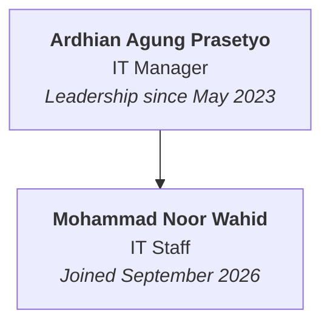
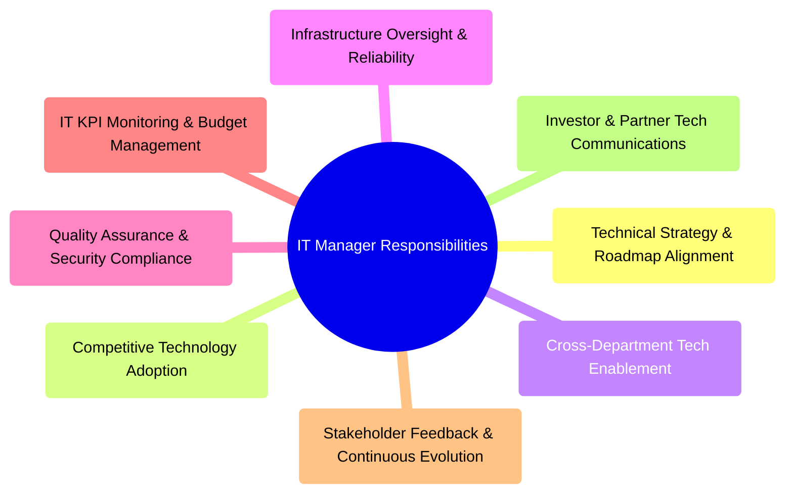
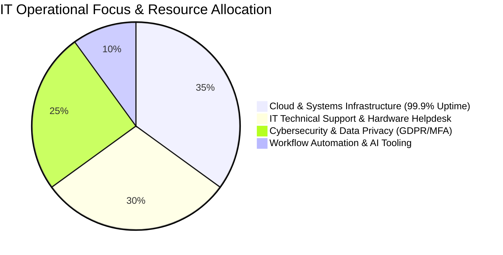
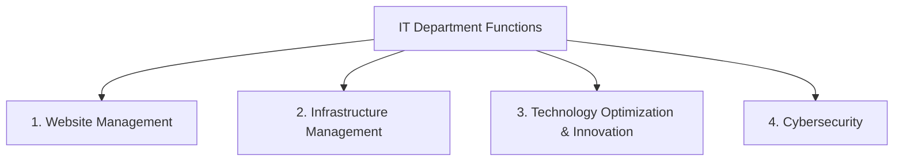

# Information Technology (IT) Department — Introduction & Handbook 2026

> **"Powering Technology, Driving Innovation, and Safeguarding Digital Assets."**  
> *Official 2026 IT Department Introduction, Team Structure, Roles & Responsibilities, ACTFIRST Values & Core Functions*  
> *Presented by Ardhian Agung Prasetyo (IT Manager) • [leadgeeksinc.com](https://leadgeeksinc.com)*

---

## Table of Contents
1. [Department History & Overview](#1-department-history--overview)
2. [Department Structure & Team Roster](#2-department-structure--team-roster)
3. [Roles & Responsibilities](#3-roles--responsibilities)
   - [IT Manager Role & Responsibilities](#it-manager-role--responsibilities)
   - [IT Staff Role & Responsibilities](#it-staff-role--responsibilities)
4. [IT Department Core Values: The ACTFIRST Framework](#4-it-department-core-values-the-actfirst-framework)
5. [Four Core IT Department Functions](#5-four-core-it-department-functions)
   - [1. Website Management](#1-website-management)
   - [2. Infrastructure Management](#2-infrastructure-management)
   - [3. Technology Optimization & Innovation](#3-technology-optimization--innovation)
   - [4. Cybersecurity & Data Protection](#4-cybersecurity--data-protection)
6. [Cross-Departmental Collaboration](#6-cross-departmental-collaboration)

---

## 1. Department History & Overview

The **Information Technology (IT) Department** at LeadGeeks Inc. was officially established in **May 2023** to build, maintain, optimize, and secure the company's technology infrastructure and proprietary digital assets.

```
┌────────────────────────────────────────────────────────────────────────────┐
│                          IT DEPARTMENT MANDATE                             │
├──────────────────┬──────────────────┬──────────────────┬───────────────────┤
│     BUILD        │     OPTIMIZE     │     SUPPORT      │      SECURE       │
│ Scalable systems │ AI, automation & │ Reliable helpdesk│ Ironclad cyber &  │
│ & web platforms  │ workflow tools   │ & IT operations  │ data protection   │
└──────────────────┴──────────────────┴──────────────────┴───────────────────┘
```

---

## 2. Department Structure & Team Roster



### Team Profiles

| Team Member | Official Role | Tenure / Joining | Primary Focus Areas |
| :--- | :--- | :--- | :--- |
| **Ardhian Agung Prasetyo** | **IT Manager** | May 2023 – Present | Technology Strategy, Architecture, Enterprise Security, Budgeting & Leadership |
| **Mohammad Noor Wahid** | **IT Staff** | September 2026 – Present | Systems Administration, AI/Automation Workflows, Helpdesk Support & Web Management |

---

## 3. Roles & Responsibilities

### IT Manager Role & Responsibilities

#### Core Objective:
> **"Lead the company’s technology strategy integration to ensure efficient, profitable, and secure tech resource utilization."**

#### Primary Focus Areas:
* Evaluate, implement, and manage enterprise systems and digital infrastructure.
* Align technology initiatives directly with overarching business goals and client needs.
* Integrate innovative software solutions and AI tooling to enhance company-wide productivity.



#### Detailed Responsibilities:
1. **Strategic Technology Alignment**: Develop and execute technical strategies tightly aligned with corporate growth targets.
2. **Competitive Innovation**: Identify, evaluate, and implement emerging software, frameworks, and technologies for competitive advantage.
3. **Cross-Functional Enablement**: Support all department heads in effectively utilizing technology, scraping tools, and software stacks.
4. **Infrastructure Stewardship**: Oversee core system architecture and server environments to guarantee functionality, uptime, and efficiency.
5. **QA & Data Protection**: Establish strict quality assurance protocols, backup policies, and security guardrails.
6. **KPI & Budget Governance**: Monitor departmental IT KPIs, software license expenditures, and technology budgets.
7. **Stakeholder Iteration**: Collect and analyze feedback from internal users and clients to guide system enhancements.
8. **External Representation**: Communicate technology capabilities and security architecture to clients, enterprise partners, and investors.

---

### IT Staff Role & Responsibilities

#### Core Objective:
> **"Support the company’s technology operations and development to ensure efficient, secure, and productive use of technology resources."**

#### Primary Focus Areas:
* Support the development, maintenance, and day-to-day administration of IT systems and infrastructure.
* Deliver responsive technical support and maintain secure, highly reliable operational environments.
* Implement workflow automation, AI platforms, and technical integrations to accelerate operational efficiency.

#### Detailed Responsibilities:
1. **Web & CMS Administration**: Manage and maintain company website hosting, DNS records, domain portfolios, SSL certificates, and Content Management Systems (CMS).
2. **Technical Support & Helpdesk**: Provide prompt, high-quality technical support and troubleshoot hardware, software, and network issues for all staff.
3. **Daily System Administration**: Assist in managing cloud infrastructure, Google Workspace, internal tools, and operational systems.
4. **Security Practice Enforcement**: Maintain cybersecurity protocols, enforce password policies, and assist with data protection initiatives.
5. **AI-Assisted Development & Prompt Engineering**: Utilize modern AI tools and AI-assisted development platforms, crafting effective prompts to streamline development, debugging, and productivity.
6. **Workflow Automation & Integration**: Build automation scripts and API integrations connecting databases, CRMs, and internal tools.
7. **Process Improvement Identification**: Proactively identify operational bottlenecks and recommend automation or tooling solutions across all departments.
8. **Project Support**: Collaborate closely with the IT Manager on strategic technology rollouts, migration projects, and infrastructure upgrades.
9. **Cross-Departmental Assistance**: Work with Operations, Growth, Experience, HRD, and Finance to fulfill specialized technical requirements.

---

## 4. IT Department Core Values: The ACTFIRST Framework

The IT Department operates according to the **ACTFIRST** value model:

```
┌────────────────────────────────────────────────────────────────────────────┐
│                            ACTFIRST VALUE SUITE                            │
├─────┬──────────────────────────────────────────────────────────────────────┤
│  A  │ ACCOUNTABILITY IN ACTION                                             │
│     │ Taking complete ownership of system uptime, code quality, and tasks. │
├─────┼──────────────────────────────────────────────────────────────────────┤
│  C  │ COLLABORATION AND CLEAR COMMUNICATION                                │
│     │ Transparent documentation, active listening, and teamwork.           │
├─────┼──────────────────────────────────────────────────────────────────────┤
│  T  │ TIMELINESS AND EFFICIENCY                                            │
│     │ Fast resolution times, punctual delivery, and streamlined processes. │
├─────┼──────────────────────────────────────────────────────────────────────┤
│  F  │ FLEXIBILITY AND AGILITY                                              │
│     │ Rapid adaptability to changing requirements and emerging tools.      │
├─────┼──────────────────────────────────────────────────────────────────────┤
│  I  │ IMPROVEMENT THROUGH LEARNING                                         │
│     │ Continuous upskilling, curiosity, and mastery of new technologies.   │
├─────┼──────────────────────────────────────────────────────────────────────┤
│  R  │ RESPECT FOR USER EXPERIENCE                                          │
│     │ Designing intuitive, frictionless, and empathetic digital workflows. │
├─────┼──────────────────────────────────────────────────────────────────────┤
│  S  │ SOLUTION-FOCUSED MINDSET                                             │
│     │ Resolving root causes rather than applying temporary patches.        │
├─────┼──────────────────────────────────────────────────────────────────────┤
│  T  │ TRUST AND PROFESSIONALISM                                            │
│     │ Ethical data stewardship, strict confidentiality, and integrity.     │
└─────┴──────────────────────────────────────────────────────────────────────┘
```

---

## 5. Four Core IT Department Functions & Resource Allocation





---

### 1. Website Management
* **Scope**: Overseeing website development, front-end performance, speed optimization, and CMS management to deliver seamless user experience, responsive design, and robust security.
* **Core Tasks**:
  * **Website Development & Performance**: UI/UX improvements, mobile optimization, page speed enhancements, and SEO technical compliance.
  * **Domain & Hosting Services Management**: DNS configuration, hosting server maintenance, CDN optimization, and SSL certificate management.
  * **Content Management Systems (CMS)**: CMS maintenance, plugin security updates, theme customization, and role-based access control.

---

### 2. Infrastructure Management
* **Scope**: Maintaining and supporting corporate data repositories, IT hardware, software environments, internal networks, and cloud architecture to ensure 99.9% uptime, security, and operational efficiency.
* **Core Tasks**:
  * **Data Management**: Structured cloud storage governance, automated backup scheduling, database integrity, and disaster recovery preparations.
  * **IT Support & Helpdesk**: Prompt troubleshooting, onboarding tech setups, credential provisioning, and device provisioning.
  * **Hardware Management**: Inventory tracking, workstation configuration, hardware diagnostics, and lifecycle maintenance.
  * **Software Management**: License management, software deployments, productivity suite maintenance, and tool rationalization.

---

### 3. Technology Optimization & Innovation
* **Scope**: Modernizing corporate technology infrastructure to increase operational leverage, integrate modern AI workflows, and create competitive market advantages.
* **Core Tasks**:
  * **Workflow Automation & Technology Integration**: Connecting disparate software stacks via webhooks/APIs, automating manual repetitive tasks, and building custom internal productivity tools.
  * **Technical Product / Service Development**: Collaborating on new technical service offerings (e.g. data scraping pipelines, enrichment scripts).
  * **Infrastructure Scalability**: Ensuring cloud servers, databases, and network architectures scale gracefully with client volume.
  * **Technology Partnerships**: Evaluating and negotiating agreements with technology vendors, API providers, and software partners.

---

### 4. Cybersecurity & Data Protection
* **Scope**: Safeguarding corporate digital assets, client information, networks, and communication channels to prevent, detect, and respond to cyber threats while enforcing strict regulatory data privacy compliance.
* **Core Tasks**:
  * **Risk Assessment & Management**: Periodic vulnerability assessments, threat modeling, and internal security audits.
  * **Network & System Security Management**: Firewall rules, endpoint protection, multi-factor authentication (MFA), and secure VPN administration.
  * **Incident Response & Disaster Recovery**: Maintaining actionable containment protocols, incident recovery runbooks, and emergency failovers.
  * **Data Privacy Compliance**: Ensuring compliance with global data privacy regulations (GDPR, CCPA, CAN-SPAM) and corporate confidentiality standards.

---

## 6. Cross-Departmental Collaboration

```
┌────────────────────────────────────────────────────────────────────────────┐
│                    IT CROSS-DEPARTMENTAL COLLABORATION                     │
├────┬───────────────────────────────────────────────────────────────────────┤
│ 01 │ PROVIDE TECHNICAL SUPPORT & TROUBLESHOOTING                           │
│    │ Delivering rapid troubleshooting for daily hardware/software issues. │
├────┼───────────────────────────────────────────────────────────────────────┤
│ 02 │ OPTIMIZE DAILY WORKFLOW USING NEW TOOLS / TECHNOLOGIES                │
│    │ Partnering directly with department leaders to identify bottlenecks   │
│    │ and deploy AI, automation, and customized scripts.                   │
├────┼───────────────────────────────────────────────────────────────────────┤
│ 03 │ GIVE TECHNICAL INSIGHT & KNOWLEDGE ON IT TOPICS                       │
│    │ Providing technical feasibility evaluations, security briefings, and │
│    │ educational workshops on emerging software & AI trends.               │
└────┴───────────────────────────────────────────────────────────────────────┘
```

* **With Operations**: Building automated scraping, verification, and lead enrichment pipelines; optimizing ISR tooling.
* **With Growth**: Implementing marketing automation, tracking pixels, inbound landing page optimization, and outbound email domain infrastructure.
* **With Experience**: Providing secure CSAT survey platforms, retention workspaces, and data dashboard integrations.
* **With HRD**: Core HRIS (Human Resource Information System) platform administration, automated onboarding/offboarding workflows, centralized identity & access management (SAML SSO), and employee data privacy protection.
* **With Finance**: Tracking software subscription costs, optimizing cloud spend, and ensuring secure payment integrations.
* **With Management Office**: Aligning technology roadmaps with 2025 company goals (*Elevate, Expand, Empower*).

---
*For IT support, automation requests, or cybersecurity inquiries, reach out to the **IT Department**.*
