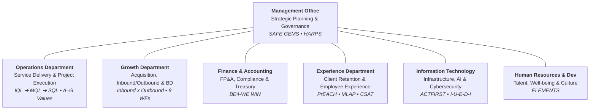

# LeadGeeks Inc. — Company & Department Onboarding Portal (2025 / 2026)

Welcome to the central documentation and knowledge base for **LeadGeeks Inc.** All PowerPoint presentations (`.pptx`), Canva slide decks (`.png`), operational training handbooks, and per-department **Top 3 Main Points** quick-reference notes are organized below.

---

## 📌 Quick-Reference: Top 3 Main Points per Department

| Topic / Department | Quick-Reference Note | 3 Key Highlights |
| :--- | :--- | :--- |
| **Company Overview** | **[`Company_Overview_Top_3.md`](file:///home/noah/project/notes/onboard/Company_Overview_Top_3.md)** | B2B high-tech niche, 2025 strategy (*Elevate, Expand, Empower*), 3 modular service suites |
| **Management Office** | **[`Management_Office_Top_3.md`](file:///home/noah/project/notes/onboard/Management_Office_Top_3.md)** | *SAFE GEMS* enterprise governance, *Hola Holo* & CBR profitability, *HARPS* leadership & MLAP |
| **Operations** | **[`Operations_Department_Top_3.md`](file:///home/noah/project/notes/onboard/Operations_Department_Top_3.md)** | `IQL` ➔ `MQL` ➔ `SQL` lead funnel, 3 service delivery pillars, PMS rubric & *A–G Values* |
| **Growth** | **[`Growth_Department_Top_3.md`](file:///home/noah/project/notes/onboard/Growth_Department_Top_3.md)** | Inbound × Outbound model, new service incubation & BD, *The 8 WEs* & GEO synergy |
| **Experience** | **[`Experience_Department_Top_3.md`](file:///home/noah/project/notes/onboard/Experience_Department_Top_3.md)** | Client retention & CSAT/NPS, employee well-being (WFA/WFC/retreats), *PrEACH* & Leaders' Camp |
| **Human Resources & Dev** | **[`HRD_Department_Top_3.md`](file:///home/noah/project/notes/onboard/HRD_Department_Top_3.md)** | End-to-end recruitment & onboarding, IDP & talent reviews, confidential counseling & *ELEMENTS* |
| **Finance & Accounting** | **[`Finance_and_Accounting_Top_3.md`](file:///home/noah/project/notes/onboard/Finance_and_Accounting_Top_3.md)** | FP&A & forecasting, bookkeeping/tax/treasury, financial SOPs & *BE4-WE WIN* values |
| **Information Technology** | **[`IT_Department_Top_3.md`](file:///home/noah/project/notes/onboard/IT_Department_Top_3.md)** | Web & cloud infrastructure, AI tooling & workflow automation, cybersecurity & *ACTFIRST* |

---

## 📚 Master Department & Operational Handbooks

| Original Source | Comprehensive Markdown Document | Key Contents |
| :--- | :--- | :--- |
| **[(Master) Company Onboarding 2025.pptx](file:///home/noah/Onboarding/(Master)%20Company%20Onboarding%202025.pptx)** | **[(Master) Company Onboarding 2025.md](file:///home/noah/project/notes/onboard/(Master)%20Company%20Onboarding%202025.md)** | Company history, 6 global sales regions, 2025 roadmap, org chart, service suites |
| **[Introduction to Management Office_2025.pptx](file:///home/noah/Onboarding/Introduction%20to%20Management%20Office_2025.pptx)** | **[Introduction to Management Office_2025.md](file:///home/noah/project/notes/onboard/Introduction%20to%20Management%20Office_2025.md)** | 8 *SAFE GEMS* functions, *HARPS* values, 2025 shared goals matrix, *The Four Ruby* |
| **[Intro to IT Dept for IT Staff.pptx](file:///home/noah/Onboarding/Intro%20to%20IT%20Dept%20for%20IT%20Staff.pptx)** | **[Intro to IT Dept for IT Staff.md](file:///home/noah/project/notes/onboard/Intro%20to%20IT%20Dept%20for%20IT%20Staff.md)** | IT Manager vs Staff roles, *ACTFIRST* values, Web, Infrastructure, AI & Security |
| **[IT Operational Training - Onboarding IT.pptx](file:///home/noah/Onboarding/IT%20Operational%20Training%20-%20Onboarding%20IT.pptx)** | **[IT Operational Training - Onboarding IT.md](file:///home/noah/project/notes/onboard/IT%20Operational%20Training%20-%20Onboarding%20IT.md)** | IT working approach (I-U-E-D-I), prioritization formula, cross-department collaboration, active initiatives & SOPs |
| **[IT Functions & Dependencies](file:///home/noah/project/notes/onboard/IT_Functions_and_Dependencies_Mapping.md)** | **[IT_Functions_and_Dependencies_Mapping.md](file:///home/noah/project/notes/onboard/IT_Functions_and_Dependencies_Mapping.md)** | Detailed functional mapping, core responsibilities, main systems/tools, and upstream/downstream cross-department dependencies |
| **[Experience Department - Department Introduction 2026.pptx](file:///home/noah/Onboarding/Experience%20Department%20-%20Department%20Introduction%202026.pptx)** | **[Experience Department - Department Introduction 2026.md](file:///home/noah/project/notes/onboard/Experience%20Department%20-%20Department%20Introduction%202026.md)** | External (CSAT/retention), Internal (WFA/retreats), *PrEACH* values, Leaders' Camp |
| **[HRD Department Deck Screenshots (9 PNGs)](file:///home/noah/Onboarding/2026-09-02-21:39:12-screenshot.png)** | **[Human Resources & Development Department Introduction 2025.md](file:///home/noah/project/notes/onboard/Human%20Resources%20&%20Development%20Department%20Introduction%202025.md)** | Staffing, Training, Comp & Benefits, *ELEMENTS* values, 10 Strategic SMART Goals |
| **[(Master) Introduction to Finance & Accounting Department 2025.pptx](file:///home/noah/Onboarding/(Master)%20Introduction%20to%20Finance%20&%20Accounting%20Department%202025.pptx)** | **[(Master) Introduction to Finance & Accounting Department 2025.md](file:///home/noah/project/notes/onboard/(Master)%20Introduction%20to%20Finance%20&%20Accounting%20Department%202025.md)** | FP&A, Accounting, Tax, Treasury, Risk, SOPs & *BE4-WE WIN* values |
| **[Intro Growth - On Boarding.pptx](file:///home/noah/Onboarding/Intro%20Growth%20-%20On%20Boarding.pptx)** | **[Intro Growth - On Boarding.md](file:///home/noah/project/notes/onboard/Intro%20Growth%20-%20On%20Boarding.md)** | Sales acquisition, marketing, BD & service incubation, *The 8 WEs* culture |
| **[Operations Department Introduction 2025.pptx](file:///home/noah/Onboarding/Operations%20Department%20Introduction%202025.pptx)** | **[Operations Department Introduction 2025.md](file:///home/noah/project/notes/onboard/Operations%20Department%20Introduction%202025.md)** | Service delivery, ISR team roster, client portfolio, `IQL`➔`MQL`➔`SQL`, *A–G* values |

---

## 🏢 Department Ecosystem Architecture

